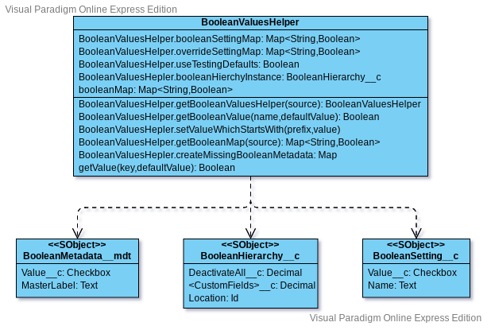
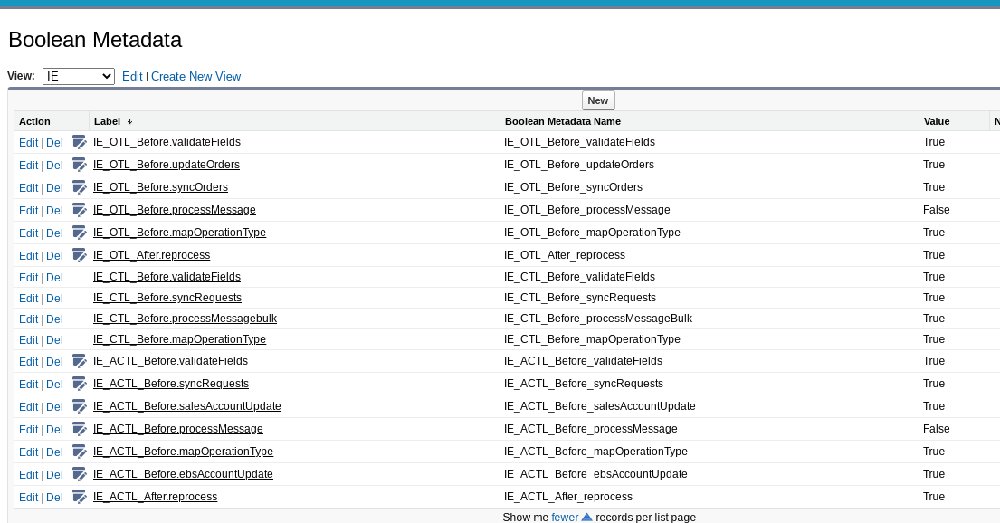

# Boolean Values Helper

The primary usage of the boolean values helper is to give developers a standardized way to activate and deactivate features from configuration.   This feature was originally developed for triggers, but with source based agile development often it is desirable to release frequently, regardless if the business and other 3rd party processes are ready for the new features.

The boolean values gives an easy way to deploy now, and activate later.  It also gives a way to deactivate depreciated code even before a push that removes the code.

## Basic Usage

As one can see in the following document there are three types of metadata referenced by the Boolean Values Helper.  Normally one would use the helper, rather than accessing any of these three types of metadata directly.  The BooleanSetting__c custom settings object is considered depreciated, and included only to maintain backwards compatability.

[VPD Document](BooleanValuesHelperUML.vpd)



Normally, one starts by calling a factory method to get the helper.  For example:

```BooleanValuesHelper <prefixName>Values = BooleanValuesHelper.getBooleanValuesHelper('<prefixName>');```

The helper will restrict itself to just values that start with specified prefix.

One can then use a value in any condition, as needed:

```
if( <prefixName>Values.getValue('<valueName>',<defaultValue>)) {
    // do your work
}
```

### An Explict Example

Suppose you have the following values in your table:



If you wanted to check the IE_CTL_Before.validateFields value you would check the code value.

```
BooleanValuesHelper beforeValues = BooleanValuesHelper.getBooleanValuesHelper('IE_CTL_Before');
if(beforeValues.get('validateFields',false)) {
    // do work here
}
```

Or alternatively:

```
if(BooleanValuesHelper.getBooleanValue('IE_CTL_Before.validateFields',false)) {
    // do work here
}
```


The value as false means if IE_CTL_Before.validateFields has not been added to the BooleanMetadata table, or we are ignoring metadata, then return a value of false.  We typically ignore metadata values when a test class is running.

## Overriding Settings

It is quite common to want to override values in code. There is a method for this.  For example, if one wanted to everride all values that start with 'IE_CTL_Before' to false, one could do this with the static method:

```BooleanValuesHelper.setValuesWhichStartWith('IE_CTL_Before.',false);```

This can be extremely useful if a test class needs to deactivate trigger handler actions.   A null value can be used to restore the original value.

If on the other hand one wanted to override just a particular setting, then the override map can be accessed directly.

```BooleanValuesHelper.overrideSettingMap.put('IE_CTL_Before.validateFields',false);```

## Configuration

There are three tables that can be populate.  In most cases just the BooleanMetadata__mdt row will be created, with a Value__c of True or False.   However, in special instances it is useful to specify a value of 'Default'.

When 'Default' has been specified, the BooleanHierachy__c custom settings instance is checked to see if there is a custom field with the same API name as the BooleanMetadata__mdt record.  If the field exists a value of 1.0 means true, and value of 0.0 means false.

If no value was specified by BooleanHierchy__c for the 'Default' value, then the BooleanSetting__c value of the same name is checked.  If that value does not exist either our Map will contain a null value as if the BooleanMetadata__mdt row was not defined, and the getValues method will return the default value.

BooleanHierchy__c is intended to be used for debugging and data migrations.  Developers should avoid using this to implement permanent conditional logic.  The custom fields are routinely removed as part of maintence in during monthly releases.

## Depreciated Usage

BooleanSetting__c was introduced into our org, before all the rest of this framework existed.  As such it used to be quite common to do a DML operation to set the boolean value within code.  However, the ```BooleanValuesHelper.overrideSettingMap``` is a much better way to override the value within code.

If you are updating code that uses BooleanSetting__c in any way, consider refactoring the code to use the helper instead.
