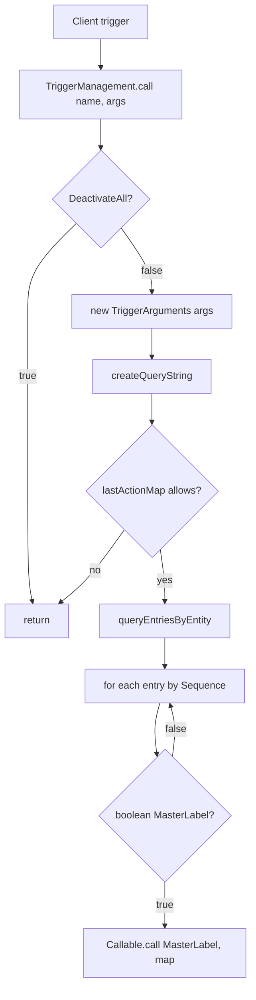

# Trigger Management — Codebase Walkthrough

Audience: developers who already follow the usage deck (client trigger + Callable handler + CMDT).
Goal: leave able to navigate `TriggerManagement` / `TriggerArguments`, explain resolution and sequencing, and ship an ApexFramework version into redhatcrm.

Copy each `## Slide N` section into a slide as needed.

This deck is **framework internals + packaging**. Usage templates live in [`usage_walkthrough.md`](usage_walkthrough.md).

---

## Slide 1: Title / goals

**ApexFramework — Trigger Management codebase walkthrough**

Walk away able to:

- Trace a live DML from client trigger → `TriggerManagement.call` → handler method
- Explain how entries are queried, ordered, gated, and deduped
- Read `TriggerArguments` (live `Trigger.*` vs synthetic maps)
- Build an unlocked ApexFramework package version
- Point that version into **redhatcrm** (`sfdx-project.json`, config YAML, release definitions)

> Notes: Package API name is **ApexFramework** (path `src/apexframework`). Point people at `usage_walkthrough.md` for “how do I add a handler?” — this session is “how does the manager decide what to call?”

---

## Slide 2: Why this code exists

Problem: multiple unlocked packages need ordered, toggleable trigger logic on the same SObject without merging one fat trigger body.

`TriggerManagement` is the **dispatcher**:

- Reads `Trigger_Management_Entry__mdt` for the current object + event
- Honors `Sequence_Number__c` and boolean activation
- Instantiates `Callable` handlers and invokes them by **MasterLabel** (action string)
- Survives multiple client triggers on the same object without re-running the same method set

Consumers own thin client triggers + handlers + CMDT. This package owns the resolution engine.

---

## Slide 3: Repo map (trigger surface)

Under `src/apexframework/main/default/`:

| Area | Artifacts |
|------|-----------|
| Dispatcher | `classes/TriggerManagement.cls` |
| Context | `classes/TriggerArguments.cls` |
| Sample handler | `classes/SObjectCallableTrigger.cls` |
| Sample client trigger | `triggers/AttachmentTriggerManagement.trigger` |
| Registration | `objects/Trigger_Management_Entry__mdt/` + `customMetadata/` |
| Activation | `BooleanValuesHelper` + `BooleanMetadata__mdt` / hierarchy |
| Tests | `TriggerManagementTest`, `TriggerArgumentsTest`, `SObjectCallableTriggerTest` |

Docs: `docs/topics/callabletriggers/` (README, usage walkthrough, this deck).

---

## Slide 4: Call flow



| Step | Class / data |
|------|----------------|
| Name string | First arg to `call` (usually trigger API name) |
| Context | `TriggerArguments` from `null` (live) or map (test / replay) |
| Selection | Dynamic SOQL on `Trigger_Management_Entry__mdt` |
| Gate | `BooleanValuesHelper.getBooleanValue` |
| Invoke | `Type.forName(Class_Name__c).newInstance()` → `call` |

`DeactivateAll` is checked **inside** `TriggerManagement.call` — client triggers do not wrap the call with that check.

---

## Slide 5: Entry — `TriggerManagement.call`

File: `TriggerManagement.cls`

```apex
public Object call(String action, Map<String, Object> args) {
    lastRethrownException = null;
    // blank / AbstractTrigger → stack-derived unique name
    if (! BooleanValuesHelper.getBooleanValue('DeactivateAll', false)) {
        TriggerArguments localTrigger = new TriggerArguments(args);
        String queryString = createQueryString(action, localTrigger);
        // lastActionMap dedupe, then query + callTriggerMethods
    }
    return null;
}
```

Behaviors to call out:

- **`DeactivateAll`** short-circuits the entire callable-trigger pipeline (framework-owned, not the client trigger)
- **`args == null`** is the production client-trigger path
- Non-blank `action` is required after AbstractTrigger / stack-name resolution
- `lastRethrownException` surfaces the last failure for callers that need it

---

## Slide 6: Unique action names (AbstractTrigger / stack)

When `action` is null, blank, or `'AbstractTrigger'`, `getUniqueTriggerString` forces an exception and parses the stack for `Trigger.<Name>` so subclassed AbstractTrigger callers still get a **stable unique key**.

Why it matters:

- Dedup key is `targetObjectType + ':' + queryString`, but **last action** remembered is the client trigger name
- Multiple packages can each fire a client trigger; only the **first** matching pass for that object/event query runs the entry list (see next slide)

Modern client triggers should pass an explicit unique string (e.g. `'AttachmentTriggerManagement'`).

---

## Slide 7: Dedup — `lastActionMap`

```apex
String key = localTrigger.targetObjectType + ':' + queryString;
String lastAction = lastActionMap.get(key);
if (lastAction == null || action.equals(lastAction)) {
    lastActionMap.put(key, action);
    // query + invoke
}
```

Intent: many client triggers on the same SObject are allowed across packages; the framework still runs each registered method **once** per object/event context for a given transaction path.

If a **different** client trigger name arrives first for the same key, a later name is skipped for that key (first writer wins for the transaction).

> Notes: Emphasize “pass a stable unique name and don’t multiply client triggers inside one package.”

---

## Slide 8: Building the CMDT query

`createQueryString` maps `TriggerArguments.triggerTypeValue` → the matching event checkbox field (`Before_Insert__c`, `After_Update__c`, …).

SOQL shape (conceptually):

- `SELECT` MasterLabel, Class_Name__c, Entity relationship QualifiedApiName, Non_Entity_Object__c, Sequence_Number__c, DeveloperName
- `WHERE` event checkbox `= true`
- Entity / Non-Entity filters (next slide)
- `ORDER BY Sequence_Number__c`

No event field match → `queryString` is null → nothing runs.

---

## Slide 9: Entity vs Non-Entity vs platform events

`getEntityBasedCondition` + `getNonEntityValue`:

| Target | Filter behavior |
|--------|-----------------|
| Standard entity | Entity field equals object API name (uppercased) |
| Custom `__c` / similar `__?` | Entity equality omitted in SOQL; filtered in memory by QualifiedApiName |
| Non-entity picklist value (e.g. Attachment) | `Non_Entity_Object__c` equals that value; entity condition empty |
| Platform event `__e` | `MasterLabel LIKE '<action>.%'` so each listener/trigger name can own its entries |

`queryEntriesByEntity` caches by query string, then indexes entries by lowercased object name from Entity and/or Non-Entity.

---

## Slide 10: Invoke loop + activation

`callTriggerMethods`:

1. Reuse `callableArguments` / `callableMap` from `TriggerArguments`
2. For each CMDT row in sequence order:
   - `BooleanValuesHelper.getBooleanValue(entry.MasterLabel, true)`
   - If true → `callTrigger`

Activation sources (via BooleanValuesHelper):

| Source | Role |
|--------|------|
| `BooleanMetadata__mdt` same MasterLabel | Explicit True / False / Default |
| `Trigger_Management_Entry__mdt.Active__c` | Treated as BooleanMetadata Value when set |
| `BooleanHierarchy__c` field | Runtime override when metadata is Default |
| Label `DeactivateAll` | Global kill switch (checked earlier in `call`) |

Handlers should **not** re-check these flags; the dispatcher already gated the call.

---

## Slide 11: Instantiation, reuse, and bad actions

```apex
Callable c = callableMap.get(entry.Class_Name__c);
if (c == null) {
    c = (Callable) Type.forName(entry.Class_Name__c).newInstance();
    callableMap.put(entry.Class_Name__c, c);
}
c.call(entry.MasterLabel, callableArguments);
```

- One instance per class name per arguments map (shared across methods on that class)
- Public no-arg constructor is required
- `ExtensionMalformedCallException` (unknown `when` action): logged, method auto-disabled in-memory for the transaction; **rethrown in tests** only when metadata says the action is active
- Other exceptions set `lastRethrownException` and propagate

---

## Slide 12: `TriggerArguments` — live vs synthetic

File: `TriggerArguments.cls`

| Mode | How you get it | Context source |
|------|----------------|----------------|
| Live trigger | `new TriggerArguments(null)` | `Trigger.new` / `old` / maps + `Trigger.is*` |
| Synthetic | `createBeforeInsert` / `createAfterUpdate` / … or hand-built map | Your fixtures |

Design contract for handlers:

- Prefer `triggerArguments.isBefore`, `newList`, `oldMap`, … — **not** `System.Trigger`
- Always pass **`ta.callableArguments`** into `Callable.call` / `TriggerManagement.call`
- `callableMap` lives on the arguments map so handler instances persist across methods in one dispatch

Factories exist for every trigger operation type used by unit tests and batch replay.

---

## Slide 13: Package samples to open in the IDE

**Client trigger** — `AttachmentTriggerManagement.trigger`:

```apex
new TriggerManagement().call('AttachmentTriggerManagement', null);
```

**Handler** — `SObjectCallableTrigger`:

- `implements Callable`, no-arg ctor
- `switch on action` → e.g. assign-legacy OwnerId → Owner__c
- Uses `TriggerArguments` in method bodies

**Test CMDT** — `Trigger_Management_Entry.TriggerManagementTest` (Non-Entity `Test`, all events, class `TriggerManagementTest`).

Walk these three files live; they are the shortest “end-to-end in this package” story.

---

## Slide 14: Debugging mental checklist

Method did not run?

1. Client trigger fired with the expected name string?
2. `DeactivateAll` false?
3. Matching `Trigger_Management_Entry__mdt` for object + event checkbox?
4. Sequence present; Entity vs Non-Entity correct?
5. Boolean / `Active__c` true for that MasterLabel?
6. Another client trigger already claimed `lastActionMap` for this object/event?
7. Handler `when` label exactly equals MasterLabel?

Unexpected exception?

- Check `TriggerManagement.lastRethrownException`
- Malformed-call in production → often soft-disabled for the txn; in tests → may rethrow

---

## Slide 15: Where usage ends and this deck ends

| Need | Deck |
|------|------|
| Add trigger / handler / CMDT / unit-test factories | [`usage_walkthrough.md`](usage_walkthrough.md) |
| How resolution, dedupe, activation, and args work | **This deck** |
| UML / proposal | `README.md`, `TriggerManagementUML.vpd`, proposal PDF/PPTX |

Next slides: **build ApexFramework** and **wire the version into redhatcrm**.

---

## Slide 16: Build — unlocked package (normal path)

Full write-up: [`docs/topics/unlockedPackage/README.md`](../unlockedPackage/README.md)

Standalone / new host repo flow:

1. Add Apex-Framework as a git submodule under `submodules/`
2. Register the package path in the host `sfdx-project.json` (point at `…/src/apexframework`)
3. Create the unlocked package on your DevHub once
4. Build a version from the submodule branch you want
5. Install / promote as needed

```bash
git submodule add <Apex-Framework clone URL>
sf package create -t Unlocked -n ApexFramework \
  -r submodules/Apex-Framework/src/apexframework/ \
  -d "Artifacts used for triggers,dml,limits,metadata etc"
sf package version create -x -c -p ApexFramework --wait 1000
sf package install --package "ApexFramework@<version>" -s AllUsers -w 1000 -u <org>
```

Prefer your own DevHub builds over consuming long-lived third-party package IDs (see unlockedPackage README).

Alternate: unmanaged deploy via `./scripts/bash/mdapi-deploy ApexFramework -u <org>` ([unmanagedPackage README](../unmanagedPackage/README.md)).

---

## Slide 17: Build — this host already has the submodule

For day-to-day Red Hat work you usually do **not** re-add the submodule.

The **ApexFramework** host repo ([`Red-Hat-SFDC/ApexFramework`](https://github.com/Red-Hat-SFDC/ApexFramework)) already wires:

| Item | Location |
|------|----------|
| Submodule source | `submodules/Apex-Framework/src/apexframework` |
| Package directory | root `sfdx-project.json` → package `ApexFramework` |
| Version aliases | `packageAliases` (e.g. `ApexFramework@1.5.1-2` → `04t…`) |

Current packaging line (host): versionNumber `1.5.1.NEXT` on that path.

Use the unlockedPackage topic when standing up a **new** host or rebuilding on a fresh DevHub. Use this repo when iterating on trigger code and creating the next `ApexFramework@x.y.z` version.

---

## Slide 18: Configure — redhatcrm package pin

To land a new ApexFramework version in CRM (not just a scratch install), update the consumer pins:

| File | Role |
|------|------|
| `redhatcrm/sfdx-project.json` → `packageAliases.ApexFramework` | Subscriber package version id (`04t…`) used as the dependency |
| `redhatcrm/config/all-scratch-packages.yml` | Scratch / preview set lists `ApexFramework` under `includeOnlyPackageDependencies` |
| `redhatcrm/config/domain-*-prepare.yml` / `domain-*-release.yml` | Domain prepare/release include `ApexFramework` where that domain needs it |
| `redhatcrm/release-definitions/release-*.yml` | `packageDependencies.ApexFramework: 04t…` pin for a named release |

Example (current pin shape):

```json
"packageAliases": {
  "ApexFramework": "04t6e0000029VK7AAM"
}
```

```yaml
# release-definitions/release-15.4.0.yml (excerpt)
packageDependencies:
  ApexFramework: 04t6e0000029VK7AAM
```

Packages that declare `"dependencies": [ { "package": "ApexFramework" } ]` in `sfdx-project.json` resolve through that alias.

---

## Slide 19: Configure — checklist for an ApexFramework bump in CRM

1. Build / promote `ApexFramework@x.y.z` (unlocked flow on the ApexFramework host DevHub)
2. Note the new `04t…` subscriber package version id
3. Update **host** `sfdx-project.json` `packageAliases` if this repo tracks the new version
4. In **redhatcrm**:
   - Set `packageAliases.ApexFramework` to the new `04t…`
   - Align `release-definitions/release-*.yml` `packageDependencies.ApexFramework` for releases that should pick it up
   - Confirm domain / scratch config YAML still lists `ApexFramework` (usually already present — no change unless introducing the package to a new domain)
5. Open the CRM PR; let CI / release pipelines consume those files

Scratch `sf package install` validates the build. **redhatcrm JSON + YAML edits** are what make the version part of PR validation and release.

> Notes: Domains (salesplanning, redhatcrm, consultingcloud, …) still respect package sequence in `sfdx-project.json`; config YAML only chooses which packages a domain prepare/release includes.

---

## Slide 20: Recap / jump links

**Engine**

1. Client trigger → `TriggerManagement.call`
2. `DeactivateAll` → `TriggerArguments` → query by event + object
3. `lastActionMap` dedupe → sequence-ordered entries
4. Per-label boolean gate → `Callable.call(MasterLabel, map)`

**Packaging**

1. Version create from `submodules/Apex-Framework/src/apexframework`
2. Pin `04t…` in redhatcrm `packageAliases` + release-definitions
3. Keep domain/scratch YAML listing intact

**Jump links**

- Code: `TriggerManagement.cls`, `TriggerArguments.cls`, `SObjectCallableTrigger.cls`, `AttachmentTriggerManagement.trigger`
- Activation: `BooleanValuesHelper.cls`, `BooleanMetadata__mdt`, `Trigger_Management_Entry__mdt`
- Usage: [`usage_walkthrough.md`](usage_walkthrough.md), [`README.md`](README.md)
- Build: [`../unlockedPackage/README.md`](../unlockedPackage/README.md), [`../unmanagedPackage/README.md`](../unmanagedPackage/README.md)
- CRM: `submodules/redhatcrm/sfdx-project.json`, `config/*.yml`, `release-definitions/*.yml`
