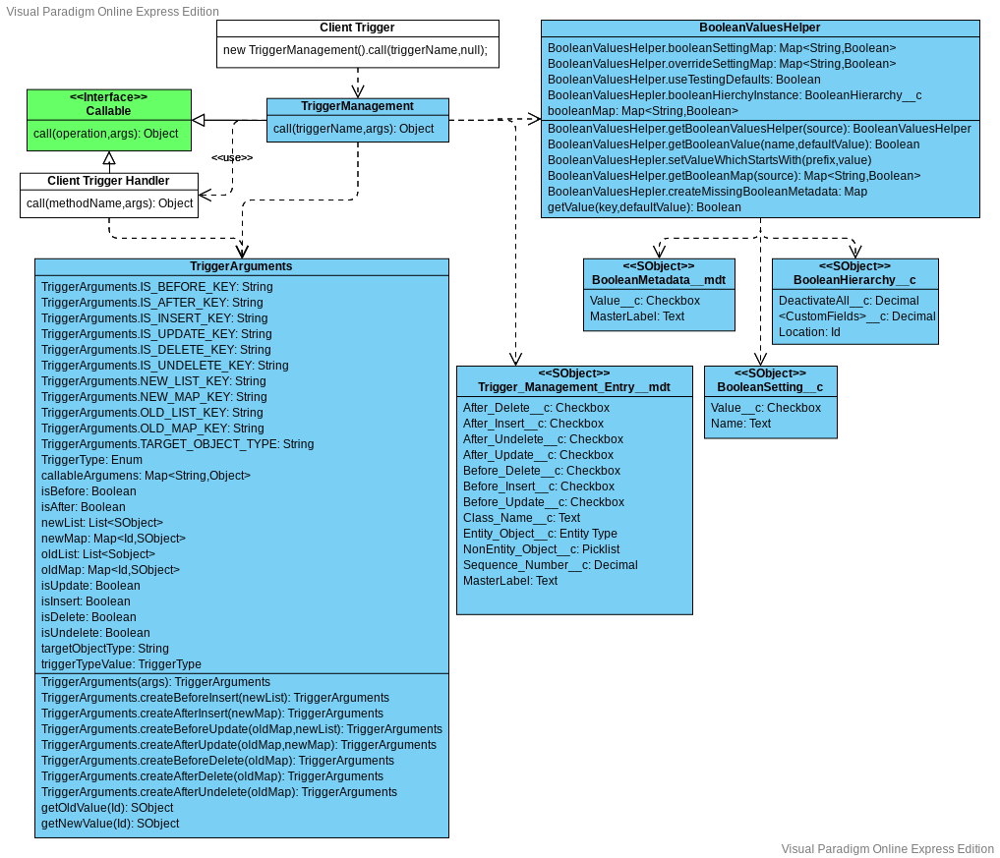
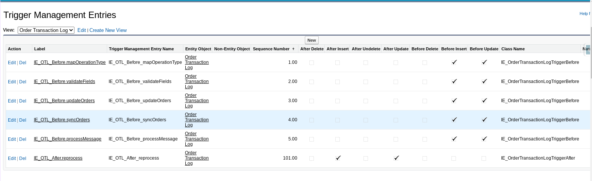

# Callable Trigger Framework

The Red Hat Callable Trigger Framework, is intended as an easy way to follow best practices while developing logically distinct triggers as part of unlocked packages.  For more about the goals of this project refere to our proposal:

Callable Trigger Prososal
- [pdf](CallableTriggerProposal.pdf)
- [libre office](CallableTriggerProposal.odp)
- [microsoft powerpoint](CallableTriggerProposal.pptx)

## Usage

As one can see in the following document, normally a user is only required to define a Client Trigger and Client Trigger Handle class to use this framework.

[VPD Document](TriggerManagementUML.vpd)




## Client Trigger

A client trigger is normally as simple as:

```
trigger <TriggerName> on <SObjectType> (
   before delete, before insert, before update,
   after delete, after insert, after update, after undelete
) {
    new TriggerManagement().call('<TriggerName>',null);
}
```

If the SObject already has an AbstractTrigger, the constructor will act as a client trigger.  You can have many client triggers per SObject, but there is no benefit in the additional triggers.  These are only allowed since multiple packages could each define their own client trigger on the same SOBject.

## Client Trigger Handler

The trigger handler is only slightly more complicated.  You need to implement the Callable interface.  Although not required, we recommend using the TriggerArguments class to for parsing the arguments map.  This will make your code look more like a normal Apex Trigger.  Only you'll be using triggerArguments, instead of just trigger.

e.g. triggerArguments.isBefore instead of Trigger.isBefore

The following is a useful template:

```
public class <ClassName> implements Callable
{
    TriggerArguments triggerArguments;

    /** You must have a public constructor that takes no arguments. */
    public <ClassName>() {}

    public void <FirstMethod>() {
        // my code goes here
    }

    public void <SecondMethod>() {
        // my code goes here
    }

    /**
     * This is the callable method to invoke the triggers in this class.
     * 
     * @param action the trigger method to invoke
     * @param args a map of Trigger values
     */
    public Object call(String action, Map<String,Object> args) {
        triggerArguments = new TriggerArguments(args);
        switch on action {
            when '<FirstMethod>' {
                <FirstMethod>();
            }
            when '<SecondMethod>' {
                <SecondMethod>();
            }
            when else {
                throw new ExtensionMalformedCallException(
                    'Method not implemented');
            }
        }
        return null;
    }

    public class ExtensionMalformedCallException extends Exception {}
}
```

Do not forget inorder for your trigger to run, you will need to define a Trigger_Management_Entry__mdt record for each of your methods.  If you do not also define a BooleanMetadata__mdt record with the same name one will automatically be created to indicate if your trigger method is currently active or inactive.

## Configuration

There are two main things to configure to use CallableTriggers.  There is Trigger_Managament_Entry__mdt and Boolean_Metadata__mdt.

### Trigger Management Entries



For each method you are defining an entry with a Label that is the name of the action that will be passed to your call method.  The checkboxes indicate which trigger events should be called, the sequencing defines order of operation.  Which action will be called first.

For specifying the SObject to trigger one normally assigns the Entity Object to the relevant SOBject.   However, there are certain objects, such as Attachments that cannot be linked as an Entity.  For those objects you must select them on the Non-Entity picklist instead.

### Boolean Metadata


The naming of Boolean Metadata is the same as the Trigger Management Entry.  A true value means the action is active, and will be called.  A false value means the action is inactive and will be ignored.   A value of Default is treated as true unless there is a BooleanHierarchy__c field or BooleanSetting__c record to override this value.

There is no need to check these settings in your trigger handler.  There is also a entry 'DeactivateAll' which will deactivate all callable triggers handlers.

Do not worry if you forget the create the Boolean Metadata entry.  It will likely automatically created for you when needed.  Even if it cannot be created, a default value of true will be used.

## Advanced Usage

It is not necessary to depend on this framework in order to use the framework.   The Callable class used as a Trigger Handler does not need to use TriggerArguments, but can directly reference the map passed in the call.  Likewise, you client trigger can use reflection to create and call the TriggerManagement class when it is defined.  Otherwise your handler class can be called directly.

The RedHatScheduleApex class has a Task trigger that implementation that does not depend on this framework, but uses this framework.
