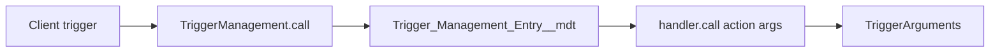

# Callable Triggers — Usage Walkthrough

Audience: developers shipping handlers in consumer packages (ApexFramework already a dependency).
Goal: leave able to add a client trigger, write a `Callable` handler, register custom metadata, enable/disable methods, and unit-test them.

This deck is **usage only**. A separate codebase walkthrough will cover framework internals later.

Copy each `## Slide N` section into a slide as needed.

---

## Slide 1: Title / goals

**Callable Triggers — Usage walkthrough**

Walk away able to:

- Add a thin client Apex trigger that calls `TriggerManagement`
- Write a `Callable` handler using `TriggerArguments`
- Register each method with `Trigger_Management_Entry__mdt`
- Enable / disable methods (`Active__c`, `BooleanMetadata__mdt`, `DeactivateAll`)
- Unit-test handlers with `TriggerArguments.create*` factories

> Notes: Point people at `docs/topics/callabletriggers/README.md` for diagrams and the proposal PDF. Do not walk `TriggerManagement` source in this session.

---

## Slide 2: What you get

Problem: fat triggers and stacked package triggers on the same SObject are hard to own, order, and turn off.

Callable triggers give you:

- **One thin client trigger** per package (or shared object) that only calls the framework
- **Many small methods** in `Callable` handler classes
- **Metadata-driven** which methods run, on which events, in which sequence
- **Per-method on/off** without redeploying Apex

Packages can each contribute handlers on the same SObject without merging one giant trigger body.

---

## Slide 3: Usage mental model



| Step | What you own |
|------|----------------|
| Client trigger | Apex `.trigger` file; pass a unique name string |
| `Trigger_Management_Entry__mdt` | Object, events, sequence, class name, action label |
| Handler | `Callable` class; `switch` on action; business logic |
| Args | Prefer `TriggerArguments` over raw `Trigger.*` |

Your registered entries are matched for the current SObject and event (honoring sequence and active flags), then each matching handler method is called.

---

## Slide 4: Client trigger

A client trigger is normally only this:

```apex
trigger MyObject_TriggerManagement on MyObject__c (
    before delete, before insert, before update,
    after delete, after insert, after update, after undelete
) {
    new TriggerManagement().call('MyObject_TriggerManagement', null);
}
```

Rules of thumb:

- Pass a **unique name** as the first argument (convention: match the trigger API name)
- Subscribe to the events you care about (often all of them)
- Multiple client triggers on the same SObject are allowed across packages; there is little benefit to several *inside* one package

See also: `AttachmentTriggerManagement.trigger` in ApexFramework; TL triggers in redhatcrm.

> Notes: Second argument is `null` in live triggers. Tests (and batch replay) may pass a synthetic `callableArguments` map instead.

---

## Slide 5: Handler skeleton

Implement `Callable`, expose a **public no-arg constructor**, and dispatch in `call`:

```apex
public class MyObjectTriggerHandler implements Callable {
    TriggerArguments triggerArguments;

    public MyObjectTriggerHandler() {}

    public void stampDefaults() {
        // business logic here
    }

    public Object call(String action, Map<String, Object> args) {
        triggerArguments = new TriggerArguments(args);
        switch on action {
            when 'MyObject_Before.stampDefaults' {
                stampDefaults();
            }
            when else {
                throw new ExtensionMalformedCallException('Method not implemented');
            }
        }
        return null;
    }

    public class ExtensionMalformedCallException extends Exception {}
}
```

`Trigger_Management_Entry` **MasterLabel** is the `action` string passed to `call`. Match your `when` clauses to that label (or parse a suffix if you use a dotted naming convention).

---

## Slide 6: Handler body style

Use `TriggerArguments` the way you would use `Trigger`:

| Instead of | Use |
|------------|-----|
| `Trigger.isBefore` | `triggerArguments.isBefore` |
| `Trigger.isInsert` | `triggerArguments.isInsert` |
| `Trigger.new` | `triggerArguments.newList` |
| `Trigger.oldMap` | `triggerArguments.oldMap` |

Keep each action method small and named for what the metadata Label describes.

```apex
public void stampDefaults() {
    if (triggerArguments.isBefore
            && (triggerArguments.isInsert || triggerArguments.isUpdate)) {
        for (SObject row : triggerArguments.newList) {
            // mutate before-save fields
        }
    }
}
```

See also: `SObjectCallableTrigger` for a reusable cross-object sample (`assignLegacy`).

---

## Slide 7: Register CMDT — fields that matter

One `Trigger_Management_Entry__mdt` record **per method** you want invoked.

| Field | Purpose |
|-------|---------|
| **Label** (MasterLabel) | Action string passed to `handler.call` |
| `Class_Name__c` | Apex class implementing `Callable` |
| `Entity_Object__c` | Target SObject when it can be linked as an Entity |
| `Non_Entity_Object__c` | Use instead for objects that cannot be Entity-linked (e.g. Attachment) |
| Event checkboxes | `Before_Insert__c`, `After_Update__c`, … |
| `Sequence_Number__c` | Order among entries for the same object/event |
| `Active__c` | Optional picklist that acts as the BooleanMetadata value for this entry |

You normally set **either** Entity **or** Non-Entity, not both.

> Notes: Lower sequence runs earlier. Event checkboxes must include the context you expect; a before-only method with only After_* checked never runs.

---

## Slide 8: Metadata XML sample

File name pattern: `Trigger_Management_Entry.<DeveloperName>.md-meta.xml`

```xml
<?xml version="1.0" encoding="UTF-8"?>
<CustomMetadata xmlns="http://soap.sforce.com/2006/04/metadata"
    xmlns:xsi="http://www.w3.org/2001/XMLSchema-instance"
    xmlns:xsd="http://www.w3.org/2001/XMLSchema">
    <label>MyObject_Before.stampDefaults</label>
    <protected>false</protected>
    <values>
        <field>Active__c</field>
        <value xsi:type="xsd:string">True</value>
    </values>
    <values>
        <field>Before_Insert__c</field>
        <value xsi:type="xsd:boolean">true</value>
    </values>
    <values>
        <field>Before_Update__c</field>
        <value xsi:type="xsd:boolean">true</value>
    </values>
    <!-- other event checkboxes false -->
    <values>
        <field>Class_Name__c</field>
        <value xsi:type="xsd:string">MyObjectTriggerHandler</value>
    </values>
    <values>
        <field>Entity_Object__c</field>
        <value xsi:type="xsd:string">MyObject__c</value>
    </values>
    <values>
        <field>Sequence_Number__c</field>
        <value xsi:type="xsd:double">1.0</value>
    </values>
</CustomMetadata>
```

Real-world shape (trimmed): `Trigger_Management_Entry.IE_OrTL_After_checkPrimaryQuote` in redhatcrm — Label `IE_OrTL_After.checkPrimaryQuote`, class `IE_OrderTransactionLogTriggerAfter`, After Insert/Update, sequence `7.0`.

---

## Slide 9: BooleanMetadata / DeactivateAll

Activation is resolved by **MasterLabel** (and related helpers), not by checks inside your handler.

| Mechanism | Behavior |
|-----------|----------|
| `Active__c` on the entry | When set, acts as the BooleanMetadata value for that trigger method |
| `BooleanMetadata__mdt` with the **same Label** as the entry | `True` / `False` / `Default` (`Default` ≈ true unless hierarchy overrides) |
| `BooleanMetadata` **DeactivateAll** | When true, **all** callable trigger handlers are skipped |

Create BooleanMetadata **manually** when you use it. Auto-create was removed (it broke Quick Deploy).

```xml
<label>DeactivateAll</label>
<values>
    <field>Value__c</field>
    <value xsi:type="xsd:string">Default</value>
</values>
```

Do **not** re-read these flags in your handler; the framework already gates the call.

---

## Slide 10: Why `TriggerArguments.create*`

Live DML runs the full client trigger + every active CMDT method — useful for smoke tests, noisy for unit tests.

Factory methods build a synthetic context map so you can:

- Invoke **one** handler method in isolation
- Supply exact `newList` / `oldMap` / `newMap` fixtures
- Cover before/after insert, update, delete, and undelete without depending on org automation side effects

Pass `ta.callableArguments` into `handler.call(...)`.

---

## Slide 11: Unit-test pattern A — call the handler

Preferred for most handler logic:

```apex
@isTest
static void stampDefaults_beforeInsert() {
    MyObjectTriggerHandler handler = new MyObjectTriggerHandler();
    List<MyObject__c> newList = new List<MyObject__c>{
        new MyObject__c(Name = 'Sample')
    };
    TriggerArguments ta = TriggerArguments.createBeforeInsert(newList);

    handler.call('MyObject_Before.stampDefaults', ta.callableArguments);

    // assert field changes on newList
}
```

Mirror of the package sample: `SObjectCallableTriggerTest.assignLegacyTest` calls `callableTrigger.call('Opp_Before.assignLegacyCallable', ta.callableArguments)`.

Also assert unknown actions throw your `ExtensionMalformedCallException`.

---

## Slide 12: Unit-test pattern B — through TriggerManagement

Use when you need org CMDT registration / sequencing / activation to participate:

```apex
TriggerArguments ta = TriggerArguments.createBeforeUpdate(oldMap, newList);
new TriggerManagement().call(
    'MyObject_TriggerManagement',
    ta.callableArguments
);
```

Requirements:

- Matching `Trigger_Management_Entry__mdt` must exist in the org under test
- Method must be active (and `DeactivateAll` must not be true)
- Client-trigger name string should match what production uses

Prefer pattern A for pure logic; use B for integration-style coverage.

---

## Slide 13: Factory cheat sheet

| Factory | You provide | Typical use |
|---------|-------------|-------------|
| `createBeforeInsert(newList)` | `List<SObject>` | Before insert field defaults |
| `createAfterInsert(newMap)` | `Map<Id,SObject>` | After insert side effects |
| `createBeforeUpdate(oldMap, newList)` | old map + new list | Before update comparisons |
| `createAfterUpdate(oldMap, newMap)` | old map + new map | After update side effects |
| `createBeforeDelete(oldMap)` | old map | Before delete guards |
| `createAfterDelete(oldMap)` | old map | After delete cleanup |
| `createAfterUndelete(newMap)` | new map | After undelete restore |

Always pass **`ta.callableArguments`** (the map), not the `TriggerArguments` instance, into `call`.

---

## Slide 14: End-to-end checklist

1. Add (or reuse) client trigger → `new TriggerManagement().call('<Name>', null)`
2. Create handler class → `implements Callable`, no-arg ctor, `call` + `switch`
3. Add **one** `Trigger_Management_Entry__mdt` per method (Label, class, object, events, sequence, Active)
4. Add matching `BooleanMetadata__mdt` if you manage enablement that way (same Label)
5. Deploy metadata + Apex together
6. Smoke: DML a row and confirm the method ran
7. Unit tests: `TriggerArguments.create*` + direct `handler.call`

---

## Slide 15: Common mistakes

- **No CMDT** — handler never runs
- **Label ≠ `when` action** — `ExtensionMalformedCallException` or silent skip after disable
- **Wrong event checkbox** — method registered but never selected for that context
- **Entity vs Non-Entity** — wrong target; Attachment-style objects need Non-Entity
- **Missing / wrong BooleanMetadata** — unexpected off; or forgetting `DeactivateAll` in a sandbox
- **Testing only via full DML** — brittle, slow, mixes many methods; prefer factory + direct call
- **Fat methods** — one Label should map to one focused action

---

## Slide 16: Where to go next

Usage reference in-repo:

- [`README.md`](README.md) — templates, UML, proposal links
- Proposal: `CallableTriggerProposal.pdf` / `.odp` / `.pptx`
- Samples: `SObjectCallableTrigger`, `SObjectCallableTriggerTest`, `AttachmentTriggerManagement.trigger`

**Next:** [`codebase_walkthrough.md`](codebase_walkthrough.md) — how `TriggerManagement` resolves and sequences entries, plus ApexFramework package build and redhatcrm configuration.

> Notes: End with Q&A on naming conventions (Label style) your team wants for new entries.
